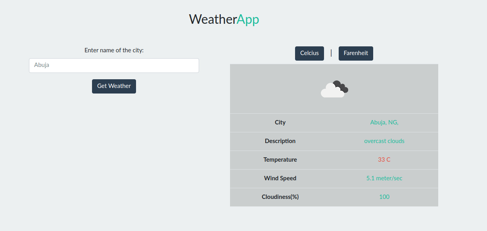

# Weather-App

> Weather App is a basic javascript app that returns weather information of requested cities from the openweather API.



## Built With

- HTML5
- CSS3
- Javascript
- Webpack

## Live Demo

[Live Demo Link](https://mosesogwo.github.io/Weather-App/)


## Getting Started

To get a local copy up and running follow these simple example steps.

 - Clone this repository to your local machine using ```git clone git@github.com:mosesogwo/Weather-App.git```.

 - Run ```cd Weather-App``` to move into the app directory.

 - Open the ```dist/index.html``` file in your browser.

To start making changes,
- Run `npm install` to install all dependencies.

- Run `npm run build` for webpack to start watching for changes

- You can now make changes to the project.

## Author

👤 **Moses Ogwo**

- Github: [@mosesogwo](https://github.com/mosesogwo)
- Linkedin: [mosesogwo](https://www.linkedin.com/in/mosesogwo/)


## 📝 License

This project is [MIT](http://www.tldrlegal.com/license/mit-license) licensed.
